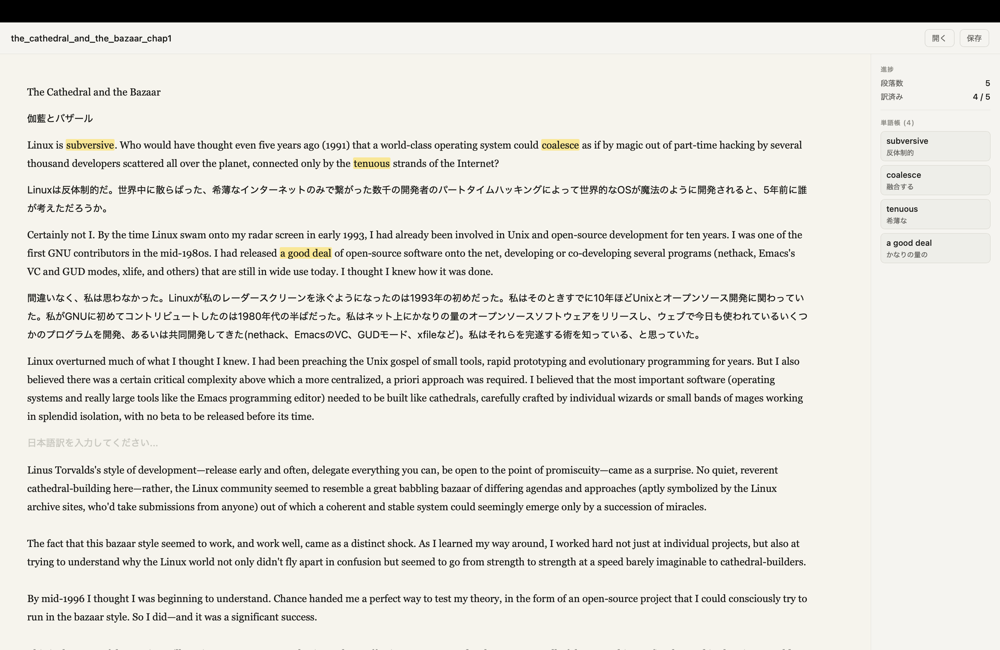
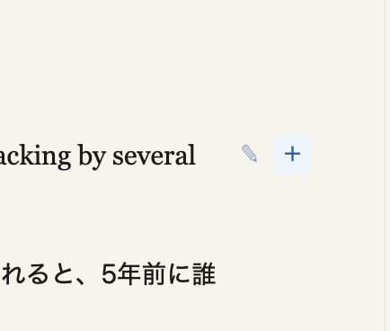
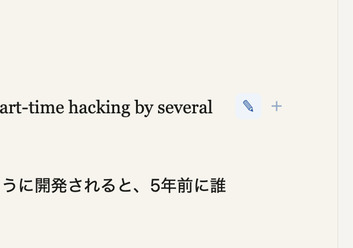

# Translate Trainer
英文読解の練習ツールです。

## 機能
- 英語のドキュメント(.txt)を開き、表示する
- 表示したドキュメントの任意の位置で日本語訳を挿入する
- 範囲選択した部分にマーカーを引き、単語帳に登録する
- 登録した単語に意味を登録する
- ドキュメントのタイトルを表示、変更する
- ドキュメント、日本語訳、ハイライト、単語帳を保存する(.json)

## 使い方
- ファイルオープン
    - "開く"ボタンからテキストドキュメントを選択する

- 日本語訳の入力
    - 開いた英文ドキュメントの日本語訳を挿入したい位置にカーソルを合わせて"+"ボタンを押す。
    
    - 日本語訳入力ブロックが現れるので、日本語訳を入力する

- マーカーを引く
    - 任意の単語、センテンスを範囲選択し、"✎"ボタンを押す
    
    - 単語帳に登録された単語、センテンスに日本語の意味を登録する

- タイトルを変更する
    - タイトル欄を選択し、任意のタイトルを入力する

- ファイルの保存
    - "保存"ボタンを押してファイル保存場所を選択する
